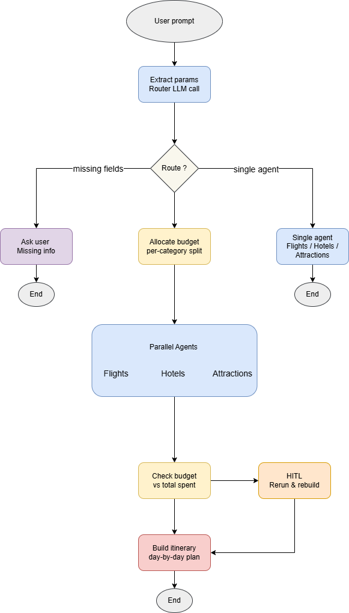

# AI Travel Planner

An AI-powered travel planning assistant that generates complete trip itineraries, including flights, hotels, attractions, and budgets through a conversational interface.

## Features

- **Conversational planning**: Chat naturally to describe your trip; the system extracts destinations, dates, budget, and preferences automatically
- **Parallel agent search**: Flights, hotels, and attractions are researched simultaneously for speed
- **Smart budget management**: Automatic budget allocation across categories with human-in-the-loop approval when costs exceed budget
- **Complete itineraries**: Day-by-day schedules with realistic timings, activity durations, and travel time between locations
- **Replan support**: Adjust dates, budget, or preferences mid-conversation — only affected agents re-run

## Architecture

The system uses a LangGraph state machine to orchestrate five specialized agents. Each node updates a shared `TravelPlanState`, which lets parallel searches safely fan out (flights, hotels, and attractions) and fan back in for budget checks, HITL decisions, and itinerary synthesis.  

  
 


**Partial planning**: the router also supports `flights_only`, `hotels_only`, and `attractions_only` intents, so queries like _"just find me hotels in Lisbon"_ run only the relevant agent and skip the rest.

### Agents

| Agent | Responsibility |
|---|---|
| **FlightAgent** | Two-phase ranking: outbound first, then returns using departure token |
| **HotelAgent** | Ranks hotels by price, rating, location, amenities, and user preferences |
| **AttractionsAgent** | Finds and categorizes top sights; balances categories across trip days |
| **BudgetManagerAgent** | Allocates budget across categories; suggests reallocation when over budget |
| **ItineraryAgent** | Synthesizes all results into a realistic day-by-day schedule |

### Tech Stack

- **UI**: Streamlit
- **Orchestration**: LangGraph (state machine with in-memory checkpointing)
- **LLM**: OpenAI
- **Search APIs**: SerpAPI (Google Flights, Google Hotels, Google Search)
- **Framework**: LangChain (tools, structured output)
- **Data validation**: Pydantic v2

## Prerequisites

- Python 3.11
- [uv](https://docs.astral.sh/uv/) package manager
- OpenAI API key
- SerpAPI key

## Setup

1. Clone the repository and install dependencies:

```bash
uv sync
```

2. Create a `.env` file in the project root:

```env
OPENAI_API_KEY=sk-...
SERPAPI_KEY=...
```

3. Run the app:

```bash
uv run streamlit run app.py
```

## Docker

Build and run with Docker — no local Python or uv required.

1. Build the image:

```bash
docker build -t ai-travel-planner .
```

2. Run the container, passing your API keys as environment variables:

```bash
docker run -p 8501:8501 \
  -e OPENAI_API_KEY=sk-... \
  -e SERPAPI_KEY=... \
  ai-travel-planner
```

3. Open [http://localhost:8501](http://localhost:8501) in your browser.

> Logs are written inside the container. To persist them, mount a volume:
> ```bash
> docker run -p 8501:8501 \
>   -e OPENAI_API_KEY=sk-... \
>   -e SERPAPI_KEY=... \
>   -v $(pwd)/logs:/app/logs \
>   ai-travel-planner
> ```

## Usage

Open the Streamlit app in your browser and describe your trip in natural language:

> "Plan a 5-day trip from London to Barcelona in June for 2 adults, budget €2000"

The assistant will:
1. Extract trip parameters (or ask for any missing ones)
2. Allocate the budget across flights, hotels, and activities
3. Search for options in parallel
4. Check if the total fits within budget (pausing for your approval if not)
5. Generate a complete day-by-day itinerary

You can follow up to adjust the plan:
> "Can you find a cheaper hotel?"
> "Change the trip to 7 days"

## Project Structure

```
ai-travel-planner/
├── Dockerfile
├── .dockerignore
├── app.py                    # Streamlit UI
├── src/
│   ├── orchestrator.py       # LangGraph workflow
│   ├── models.py             # Pydantic data models
│   ├── logger.py             # Structured JSON logging
│   ├── agents/
│   │   ├── flight_agent.py
│   │   ├── hotel_agent.py
│   │   ├── attractions_agent.py
│   │   ├── budget_agent.py
│   │   └── itinerary_agent.py
│   └── tools/
│       ├── flight_tools.py
│       ├── hotel_tools.py
│       ├── attraction_tools.py
│       └── budget_tools.py
├── logs/
└── pyproject.toml
```

## Logging

All API calls and agent runs are logged as structured JSON to `logs/travel_planner.log` (rotating, 10 MB max, 5 backups). Console output shows INFO-level summaries.
