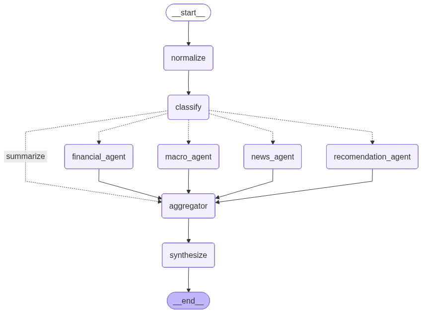

# Floccs Chatbot 🤖

A developed financial advisor agentic ai, built with:

* **LangChain**
* **LangGraph**
* **OpenAI GPT models**
* **MCP**
* **uv** (Python package manager)

---

## 🏗️ Architecture Overview

### Core Stack

| Component | Technology |
| :--- | :--- |
| **LLM** | gpt-5-mini |gpt-4o-mini
| **Orchestration** | LangGraph |
| **Dependency Manager** | uv |

---

## 📂 Project Structure

```text
src/financial_analysis_agent/
│
├── agents/
│   └── models.py
│
├── graphs/
│   └── graph.py
│
├── prompts/
│   └── prompts.py
│
├── state/
│   ├── state.py/
|
├── tools/
│   ├── mcp.py/
|   └── tools.py
│
├── config.py
├── logger.py/

```

## ⚙️ How It Works

The system follows the flow below:


---

## 🚀 Installation

### 1️⃣ Clone the Repository
git clone [https://github.com/mrig-gmbh/financial-analysis-agent.git](https://github.com/your-org/financial-analysis-agent.git)

```bash
cd financial-analysis-agent
```
### 2️⃣ Install Dependencies (uv)
If you don’t have **uv**:

- pip install uv

### 3️⃣ Install all dependencies

- uv sync

## 🔑 Environment Variables

Create a `.env` file in the project root:
- Define your model API keys in the `.env` file.

<code> OPENAI_API_KEY=your_openai_api_key </code>


## 🧩 LangGraph CLI Setup

### 1️⃣ Install the LangGraph CLI

> Python >= 3.11 is required.

Using **pip**:

- pip install -U "langgraph-cli[inmem]"

Using **uv**:

- uv add langgraph-cli[inmem]

Then in the root of your project, run:

- uv sync

Then start the LangGraph server:

- uv run langgraph dev --allow-blocking

For more information about LangGraph server , visit [LangGraph](https://docs.langchain.com/oss/python/langgraph/local-server)

### When the server is up and running, you can start frontend:
- Go to https://agentchat.vercel.app/
- Press "Continue" to start the chatbot

## 📝 License

MIT
