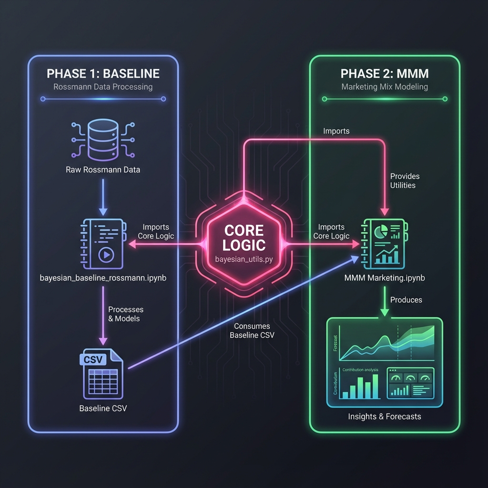

# Rossmann Marketing Mix Modeling (MMM)

This project implements a multi-stage Bayesian modeling pipeline to analyze Rossmann store sales, establish a non-promotional baseline, and quantify the effectiveness of various marketing activities.

## Functional Architecture

The system is organized into distinct functional layers, ensuring a clean separation of concerns from raw data ingestion to final business insights.


## Software Architecture


## File Overviews

### 📄 bayesian_utils.py
The central engine of the project. This module contains:
- **Data Preprocessing**: Functions to clean and transform raw Rossmann data into modeling-ready tensors.
- **Model Definitions**: Hierarchical Bayesian model structures using PyMC for both baseline and MMM stages.
- **Inference Utilities**: Wrappers for MCMC sampling, posterior predictive checks, and convergence diagnostics.
- **Forecasting Tools**: Spline-based baseline forecasting and future scenario simulation helpers.

### 📓 bayesian_baseline_rossmann.ipynb
The first stage of the analytical pipeline. Its primary goals are:
- **Organic Baseline Establishment**: Fitting a model that captures seasonality, holidays, and competition *without* promotional flags.
- **Counterfactual Analysis**: Estimating what sales would have been if no promotions occurred.
- **Empirical Lift Derivation**: Calculating the difference between actual sales and the predicted baseline to derive "Discount Intensity."

### 📓 MMM Marketing.ipynb
The second and final stage of the analytical pipeline. It focuses on:
- **Promotion Quantification**: Modeling the incremental impact of `Promo` and `Promo2` using the enriched baseline data.
- **Sales Decomposition**: Visualizing total sales as a stack of organic demand vs. marketing-driven lift.
- **Future Simulation**: Running "What-if" scenarios for H2 2015 to forecast sales on future marketing calendars.

## Getting Started

### Prerequisites

- **Python 3.13**: Ensure you have Python 3.13 installed.
- **C++ Compiler**: `PyMC` and `Aesara`/`PyTensor` require a C++ compiler for model compilation.
  - **Windows**: `scoop install gcc`.
  - **Linux**: `sudo apt-get install build-essential`
  - **macOS**: `xcode-select --install`

### Installation

1. Clone the repository:
   ```bash
   git clone https://github.com/mrig-ai/ai-engineering-group.git
   cd ai-engineering-group/mmm-bayesian-inference
   ```

2. Install the required dependencies:
   ```bash
   pip install -r ai-engineering-group/mmm-bayesian-inference/requirements.txt
   ```

### Running the Project

1. Start Jupyter Notebook:
   ```bash
   jupyter notebook
   ```

2. Open and run the notebooks in order:
   - `bayesian_baseline_rossmann.ipynb`
   - `MMM_Marketing.ipynb`